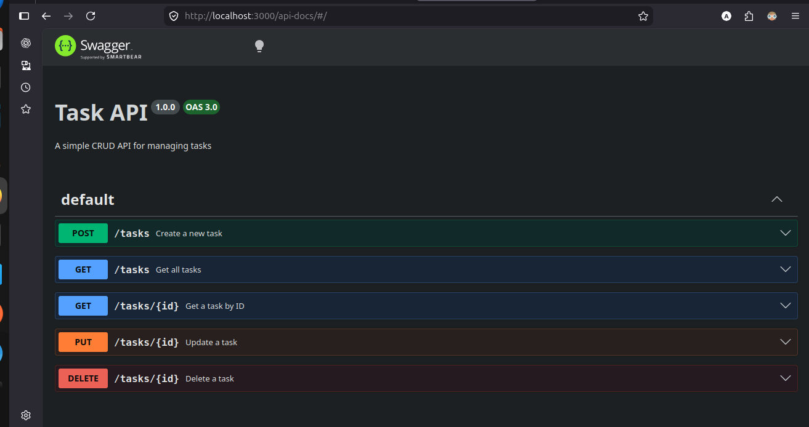
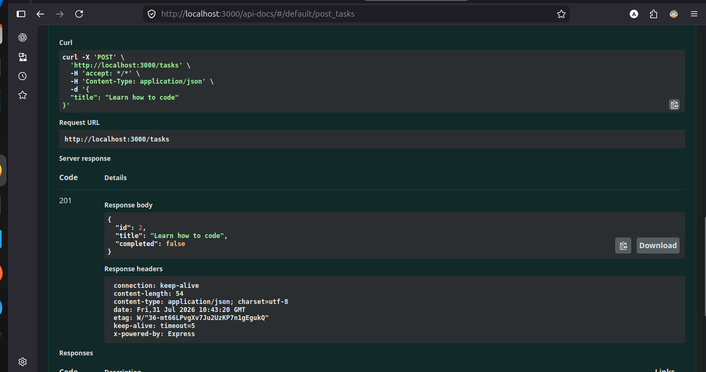
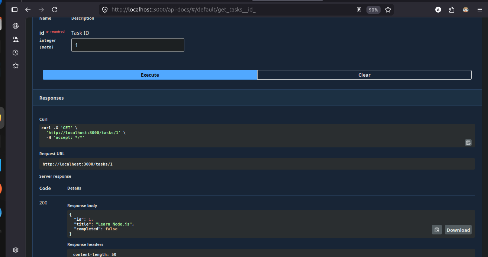
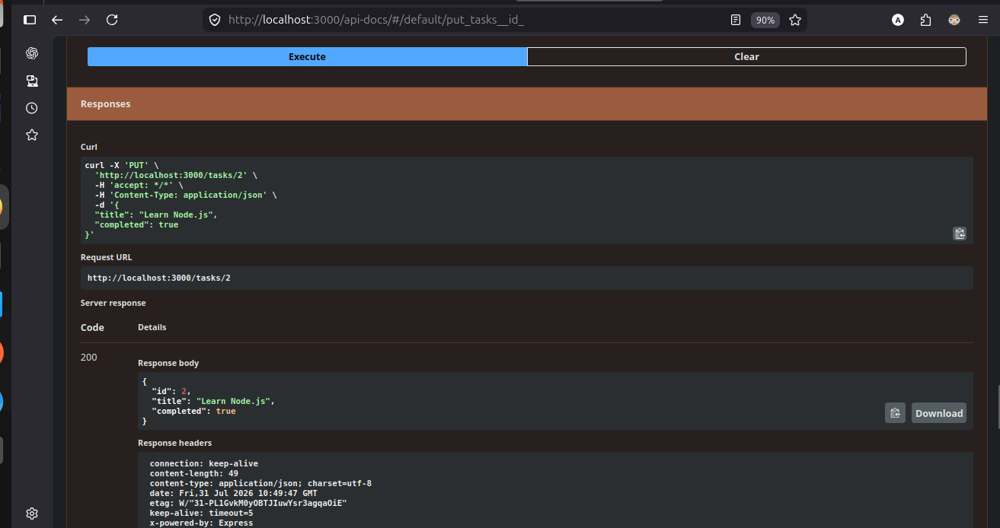
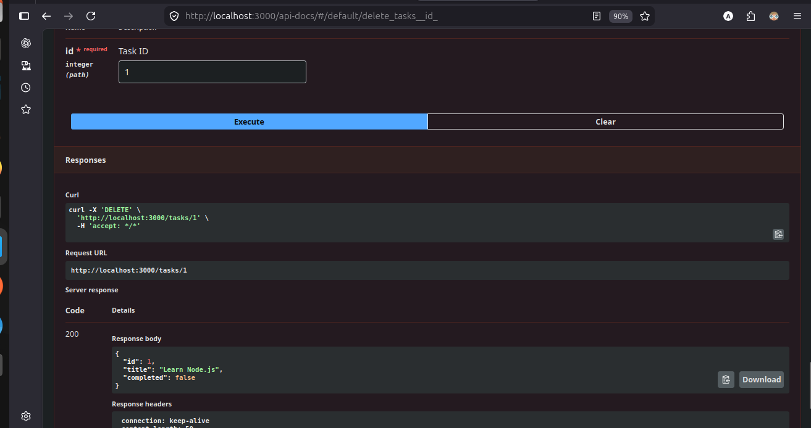
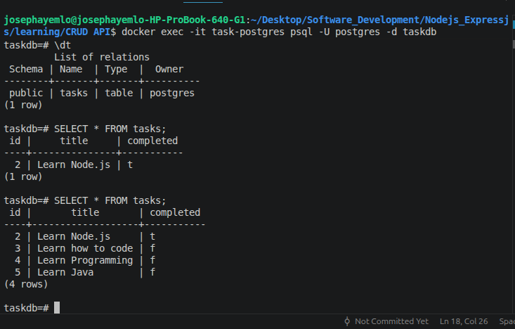

# Task API

A RESTful Task Management API built with Node.js, Express, and PostgreSQL. The application is containerized with Docker Compose, so the API and its database start together with a single command.

Swagger UI provides an interactive interface for exploring and testing every endpoint.

## Features

- Create, retrieve, update, and delete tasks
- Persistent PostgreSQL storage
- Automatic `tasks` table creation
- Swagger UI API documentation
- Health-check endpoint
- Dockerized API and PostgreSQL services

## Tech Stack

- Node.js and Express.js
- PostgreSQL and `pg`
- Docker and Docker Compose
- Swagger UI Express and Swagger JSDoc
- dotenv

## Run with Docker

### Prerequisites

- [Docker](https://docs.docker.com/get-docker/)
- Docker Compose (included with current Docker Desktop installations)

### Start the application

Clone the repository and enter the project directory:

```bash
git clone https://github.com/josephayemlo/task-api.git
cd task-api
```

Build the image and start the API and PostgreSQL database:

```bash
docker compose up --build
```

The API is available at <http://localhost:3000>, and Swagger UI is available at <http://localhost:3000/api-docs>.

Docker Compose waits until PostgreSQL is healthy before starting the API. Task data is kept in the `postgres_data` Docker volume, so it persists when containers are stopped.

To start the existing containers in the background later:

```bash
docker compose up -d
```

To stop the containers while keeping database data:

```bash
docker compose down
```

## API Endpoints

| Method | Endpoint | Description |
| --- | --- | --- |
| POST | `/tasks` | Create a new task |
| GET | `/tasks` | Retrieve all tasks |
| GET | `/tasks/:id` | Retrieve one task |
| PUT | `/tasks/:id` | Update a task |
| DELETE | `/tasks/:id` | Delete a task |
| GET | `/health` | Check API health |

## Database

The API creates this table automatically on startup:

| Column | Type | Description |
| --- | --- | --- |
| `id` | `SERIAL` | Primary key, auto-incremented |
| `title` | `TEXT` | Required task title |
| `completed` | `BOOLEAN` | Completion status, defaults to `FALSE` |

## Screenshots

The screenshots below are stored in this repository and use relative paths, so they render directly on GitHub after the `screenshots/` folder is committed and pushed.

### Swagger UI



### Create a task



### Retrieve tasks



### Retrieve a task by ID


### Update a task



### Delete a task



### PostgreSQL data


